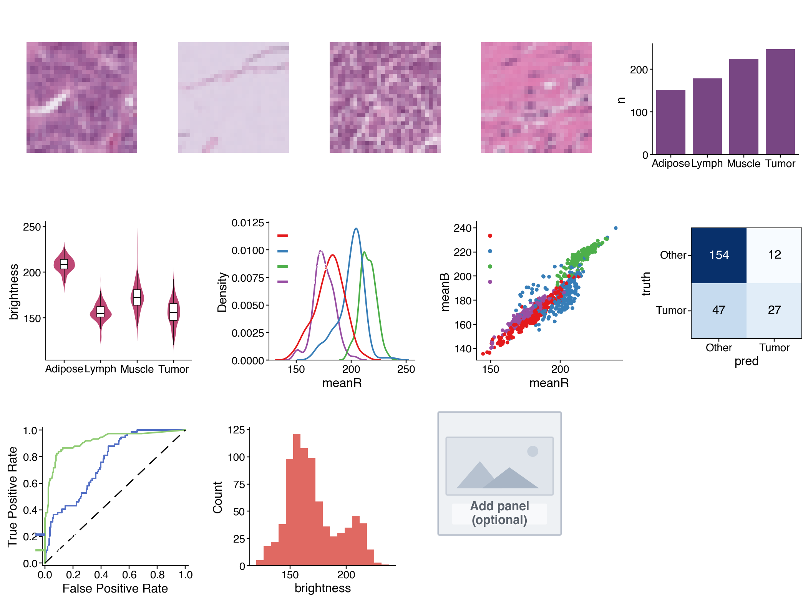

## Goal

By the end of this lab you will practise **pandas** feature tables and **cnsplots** multi-panel figures on a real medical imaging dataset. You will load PathMNIST colorectal histology images, build colour/brightness features, explore differences across tissue types, run a small classification teaser, and assemble **your own** multi-panel scientific figure.

**This lab is Python only** (Colab recommended, or VS Code locally).

**How to work:** you will **build a notebook from a blank file**, type each cell by hand, run it, and observe the output. You do not need to memorise APIs — type along, understand each step, then **customise your own figure** at the end.

**Business / clinical context:** you are a **data analyst** working with a Pathology department. Every day, clinicians produce thousands of **tissue image patches** from **colorectal cancer** biopsies. Manual review is slow and tiring. The department asks: *“Analyse this histology set — how do tissue types differ? Can we separate **tumor** from non-tumor using data? Present the findings as **one scientific figure** for a tumour-board report.”*

This is a **data-assisted diagnosis** scenario — a realistic healthcare analytics use case. In this lab you will: use **pandas** to turn images into a feature table → explore tissue differences → try a small model to predict tumor → present everything as a **multi-panel, Nature-style figure** with **cnsplots**.

**Takeaway:** turning raw data into a *convincing scientific visual* is a skill that helps your analysis get heard — in healthcare, business, or research.

> **PathMNIST:** a curated colorectal histology image set (28×28 RGB), each image with a **tissue-type label**, open licence (CC BY 4.0). Because the figure uses *images and labels from the same set*, the visuals match the data you analyse.

---

## Learning objectives

1. Load data and build a **feature table** with pandas.
2. Read, understand, and **edit** cnsplots charting code.
3. Compose charts into **one publication-style multi-panel figure**.
4. **Interpret** the figure: what does it say about the data?

---

## Prepare (once)

**Download the data:** get **`pathmnist.npz`** from:

[https://zenodo.org/records/10519652/files/pathmnist.npz?download=1](https://zenodo.org/records/10519652/files/pathmnist.npz?download=1)

(Open the link in a browser; the file downloads automatically — a few hundred MB.)

**Create a blank notebook:**

- **Colab (recommended — nothing to install):** go to [colab.research.google.com](https://colab.research.google.com) → **File → New notebook**. Then open the **Files** icon (left sidebar) → **Upload** → choose `pathmnist.npz`. *(The file lands in `/content` and is ready to use. If the runtime restarts, upload again.)*
- **Local machine (VS Code):** create a new file `lab4.ipynb` in the **same folder** as `pathmnist.npz`.

> From here, each **Cell N** below is **one code cell** you type into the notebook and run (Shift+Enter).

---

## Build the notebook — cell by cell

### Cell 1 — Install packages

```python
!pip install -q cnsplots scikit-learn
```

*(On a machine where these are already installed, you can skip this, or run `pip install cnsplots scikit-learn` in a terminal.)*

### Cell 2 — Imports

```python
import os
import numpy as np
import pandas as pd
import matplotlib.pyplot as plt
import cnsplots as cns
from sklearn.linear_model import LogisticRegression
from sklearn.ensemble import RandomForestClassifier
from sklearn.model_selection import train_test_split
print("cnsplots", cns.__version__)
```

### Cell 3 — Load PathMNIST

`pathmnist.npz` is a NumPy archive with images + labels (no `medmnist` / `torch` required).

```python
data = np.load("pathmnist.npz")
imgs   = data["train_images"]            # (N, 28, 28, 3) — N images, each 28×28 colour
labels = data["train_labels"].flatten()  # tissue-type label per image
print("Images:", imgs.shape[0], "| each image shape:", imgs.shape[1:])
```

> If you see *"No such file"*: check that `pathmnist.npz` is in the working directory (Colab: did you Upload?; local: same folder as the notebook).

### Cell 4 — pandas: build a feature table

Each image → mean brightness of channels **R, G, B** plus overall brightness. Keep four representative tissue types and use **short names** so charts stay readable.

```python
SHORT = {0: "Adipose", 3: "Lymph", 5: "Muscle", 8: "Tumor"}   # 4 tissue types
order = ["Adipose", "Lymph", "Muscle", "Tumor"]

rng = np.random.default_rng(0)
idx = np.where(np.isin(labels, list(SHORT)))[0]       # images in the 4 classes
idx = rng.choice(idx, size=min(800, idx.size), replace=False)  # sample up to 800
sub_imgs, sub_lab = imgs[idx], labels[idx]

df = pd.DataFrame({
    "label": [SHORT[l] for l in sub_lab],
    "meanR": sub_imgs[:, :, :, 0].mean(axis=(1, 2)),
    "meanG": sub_imgs[:, :, :, 1].mean(axis=(1, 2)),
    "meanB": sub_imgs[:, :, :, 2].mean(axis=(1, 2)),
})
df["brightness"] = df[["meanR", "meanG", "meanB"]].mean(axis=1)
df.head()
```

### Cell 5 — Get familiar with the table (pandas)

```python
df.describe()          # descriptive stats
```

```python
df["label"].value_counts()   # image count per tissue type
```

### Cell 6 — Quick plot (matplotlib)

```python
df["brightness"].plot(kind="hist", bins=20, title="Brightness distribution")
plt.show()
```

### Cell 7 — Two models → data for confusion matrix & ROC

Predict **Tumor vs Other** from colour features (classification teaser).

```python
X = df[["meanR", "meanG", "meanB", "brightness"]].values
y = (df["label"] == "Tumor").astype(int).values
Xtr, Xte, ytr, yte = train_test_split(X, y, test_size=0.3, random_state=0, stratify=y)

lr = LogisticRegression(max_iter=500).fit(Xtr, ytr)
rf = RandomForestClassifier(n_estimators=120, random_state=0).fit(Xtr, ytr)

pred = lr.predict(Xte); m = {0: "Other", 1: "Tumor"}
conf_df = pd.DataFrame({"truth": [m[v] for v in yte], "pred": [m[v] for v in pred]})
roc_df  = pd.DataFrame({"label": yte,
                        "Logistic":     lr.predict_proba(Xte)[:, 1],
                        "RandomForest": rf.predict_proba(Xte)[:, 1]})
print("Accuracy:", round((pred == yte).mean(), 3))
```

---

## Build a multi-panel FIGURE (main part)

cnsplots idea: create a `multipanel` “frame”, add each **panel** with `mp.panel("A", width, height)`; use `mp.newline()` to start a new row; finish with `cns.savefig(...)`.

**Sample figure for reference** (one complete result you can aim toward — *yours does not need to look identical*):



*The sample above includes: four representative tissue images + sample counts (row 1); brightness violin, colour-channel KDE, colour-space scatter (row 2); confusion matrix, two-model ROC, histogram, empty panel (row 3). This is only **one example** — in the next section you choose panels and layout yourself.*

### Cell 8 — Figure frame + a few starter panels

Type this cell first to learn the mechanism (it builds a 3-panel figure):

```python
def first_img(cls_id):                       # one representative image for a tissue class
    return imgs[np.where(labels == cls_id)[0][0]]

mp = cns.multipanel(max_width=560,
                    title="Figure 1 — Colorectal Histology Analysis",
                    title_fontweight="bold", loc="left")

# Panel A: one tumor tissue image
ax = mp.panel("A", 72, 72); ax.imshow(first_img(8)); ax.set_title("Tumor", fontsize=7); ax.set_axis_off()

# Panel B: barplot of sample counts per type
mp.panel("B", 95, 72, color_cycle="Bold")
cnt = df["label"].value_counts().reindex(order).reset_index(); cnt.columns = ["label", "n"]
ax = cns.barplot(data=cnt, x="label", y="n", order=order); ax.set_title("Sample count"); ax.set_xlabel("")

# Panel C: colour-space scatter
mp.panel("C", 95, 72, color_cycle="Set1")
ax = cns.scatterplot(data=df, x="meanR", y="meanB", hue="label", s=5); ax.set_title("Color space")
ax.get_legend().set_title(None)

cns.savefig("Figure.png")   # use .pdf / .svg for vector output in reports
print("Saved Figure.png")
```

Run the cell → you should see a 3-panel figure A–B–C. **This is the skeleton.** Your task in the next section: **add more panels** to make a larger, polished figure that is *yours*.

---

## Requirement — YOUR figure, not a clone

Expand the Cell 8 figure into a larger layout (**at least 6 panels**) by **picking extra panels from the menu below** and adding new rows with `mp.newline()`. Every student should produce a different figure depending on panels and layout.

**How to start a new row** (place between panels):

```python
mp.newline()   # new row; use margin_top=16 on the first panel of a row for breathing room
```

### Panel menu (copy into your figure, then edit)

**① Tissue image** (add another class — IDs: 0=Adipose, 3=Lymph, 5=Muscle, 8=Tumor):

```python
ax = mp.panel("D", 72, 72); ax.imshow(first_img(0)); ax.set_title("Adipose", fontsize=7); ax.set_axis_off()
```

**② Violin — distribution of one feature by tissue type:**

```python
mp.panel("E", 95, 90, margin_top=16, color_cycle="Ecotyper3")
ax = cns.violinplot(data=df, x="label", y="brightness", order=order); ax.set_title("Brightness"); ax.set_xlabel("")
```

**③ KDE — density of one colour channel:**

```python
mp.panel("F", 95, 90, margin_top=16, color_cycle="Set1")
ax = cns.kdeplot(data=df, x="meanR", hue="label"); ax.set_title("meanR density"); ax.get_legend().set_title(None)
```

**④ Histogram:**

```python
mp.panel("G", 95, 90, margin_top=16)
ax = cns.histplot(data=df, x="brightness"); ax.set_title("Brightness hist")
```

**⑤ Confusion matrix (uses `conf_df` from Cell 7):**

```python
mp.panel("H", 72, 80, margin_top=16)
ax = cns.confusionplot(data=conf_df, x="pred", y="truth", add_pvalue=False,
                       x_order=["Other","Tumor"], y_order=["Other","Tumor"], cmap="Blues")
ax.set_title("Confusion")
```

**⑥ ROC (uses `roc_df` from Cell 7):**

```python
mp.panel("I", 95, 90, margin_top=16, color_cycle="ECharts")
ax = cns.rocplot(roc_df, "label", ["Logistic", "RandomForest"]); ax.set_title("ROC")
```

**⑦ Boxplot / ⑧ Placeholder (space reserved for later):**

```python
mp.panel("J", 95, 90, margin_top=16)
ax = cns.boxplot(data=df, x="label", y="meanG", order=order); ax.set_title("meanG"); ax.set_xlabel("")
# or:
mp.panel("K", 80, 80, margin_top=16); cns.placeholderplot("Add panel\n(optional)")
```

> **Remember:** keep `cns.savefig("Figure.png")` as the **last** line (after all panels) so the figure is saved as an **image** for the report in the submission section. Label panels (A, B, C…) in the order you add them.
>
> *(Colab: after running, download `Figure.png` via **Files** → right-click → Download.)*

**Required for submission:** figure with ≥ **6 panels**, including **at least 1 tissue-image panel** and **at least 1 model-evaluation panel** (confusion or ROC). Beyond that, **customise**: change colour cycles, titles, or create a new pandas feature (e.g. `df["ratioRB"] = df["meanR"]/df["meanB"]`) and plot it.

---

## Interpret the figure — what does it say?

Answer from **your own figure**:

**Q1 — Class balance.** Which tissue type has the **most / fewest** samples? Is the data balanced? Why does that matter?

**Q2 — Discriminative features.** Looking at violin / KDE / scatter: which tissue is **brightest / darkest**? Do any pairs **overlap** in colour space and look hard to separate? What does that suggest about recognising tissue from colour alone?

**Q3 — Model quality.** On the confusion matrix, how many Tumor cases are correct / wrong? On the ROC, which model is better? If AUC = 1.00, is that **realistic**, or is the task too easy?

**Q4 — Clinical meaning.** Are colour features alone enough to help a clinician separate cancer? Should this tool **replace** or **support** the clinician?

> Write a **figure caption** (2–3 sentences) as in a paper, summarising what your figure shows.

---

## What to submit — ONE PDF only

You **do not submit the notebook**. Instead, write a **short report** in Word (`.docx`), **export to `.pdf`**, and submit **only that PDF**.

### Report steps

1. Create a new Word file (Microsoft Word, or **Google Docs** — both can export PDF).
2. **Insert the figure:** **Insert → Picture**, choose the `Figure.png` you saved above. Centre it on the page.
3. Fill in the sections using the structure below.
4. **Export PDF:** Word → **File → Save As / Export → PDF** (Google Docs → **File → Download → PDF**).
5. Name the file `Lab4_FullName_StudentID.pdf` and submit **only this PDF**.

Submission folder / LMS link will be announced in class (or on the course site when published).

### Report structure (~1–2 pages)

- **Title:** Lab 4 — Full name, student ID, class.
- **1. Figure:** your figure (paste `Figure.png`) plus a **figure caption** (2–3 sentences) summarising what it shows.
- **2. Analysis — answer Q1–Q4** (above): 2–4 lines each.
- **3. Customisation note:** which panels you added/changed relative to the Cell 8 skeleton and **why** (2–3 lines).

**Suggested grading weights:** figure meets requirements & is clear (40%) · Q1–Q4 analysis (35%) · creativity / customisation (25%).

> **Note:** submit **PDF only**. Do not submit the `.ipynb` notebook or the original `.docx`.

---

## Common troubleshooting

| Problem | Fix |
|---------|-----|
| `No such file: pathmnist.npz` | Colab: Upload again (Files → Upload). Local: put the file next to the notebook |
| `ModuleNotFoundError: cnsplots` | Re-run Cell 1: `!pip install -q cnsplots scikit-learn` |
| Axis labels overlapping | Shorten class names, or increase `margin_top` on the first panel of a row |
| Figure looks cramped | Increase `max_width` in `cns.multipanel(...)` |
| `get_legend()` returns None | That panel has no legend — remove the `.get_legend()...` line |

---

## References

- **cnsplots** — docs & examples: [https://cnsplots.farid.one/latest](https://cnsplots.farid.one/latest) (Getting Started, Examples Gallery).
- **PathMNIST / MedMNIST v2** — dataset: [https://medmnist.com](https://medmnist.com) (CC BY 4.0).
- Course lecture notes: Week 4 slides / `lec4.md` (pandas + cnsplots).
