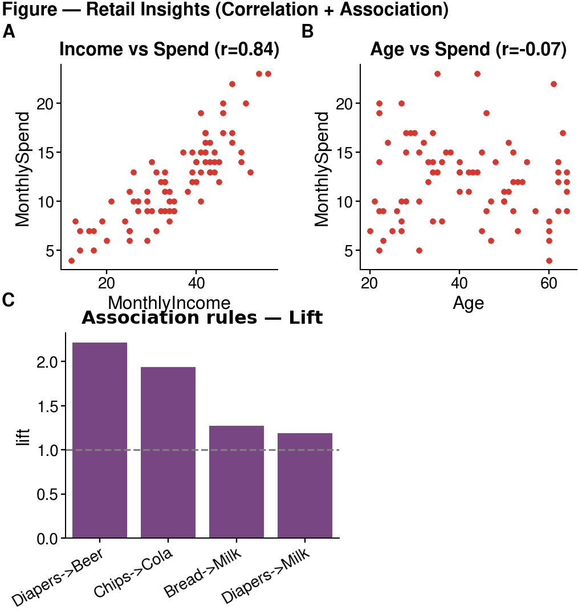

## Goal

By the end of this lab you will apply the **Week 5** ideas on **finding relationships** to a real retail scenario, using **Orange** (drag-and-drop, no code):

1. Use **Correlation** to see which numeric customer factors relate to monthly spending.
2. Use **Association Rules** to find which products are frequently bought together.
3. Synthesise both findings into **one publication-style figure** with **cnsplots** (the library from Lab 4).

**This lab is Orange only (drag-and-drop). No coding required** — except the short, ready-to-run cnsplots snippet in Part D.

**Business context:** you are an analyst at a **supermarket chain**. Management wants to know: (1) *which customer factors relate to spending?* and (2) *which products are often bought together, for combos / shelf placement?* You will answer both in Orange — with **Correlation** (for numeric variables) and **Association Rules** (for products).

---

## Prepare

1. Open **Orange Data Mining**.
2. **Download the dataset** `retail_customers.csv`:
   - Direct download: [retail_customers.csv](../assets/materials/retail_customers.csv)
   - Or from the course Drive folder: [dataset folder](https://drive.google.com/drive/folders/1CpesuxhRWxfsmseJQljkNcKVVWe578iv?usp=sharing)

---

## Dataset: `retail_customers.csv`

80 customers × 11 columns:

| Group | Column | Meaning |
|-------|--------|---------|
| Identifier | `CustomerID` | Customer ID (meta) |
| **Numeric** (for Correlation) | `Age` | Age |
| | `MonthlyIncome` | Monthly income (million VND) |
| | `MonthlySpend` | Monthly spend at the supermarket (million VND) |
| | `VisitsPerMonth` | Visits per month |
| **Products** Yes/No (for Association Rules) | `Diapers, Beer, Bread, Milk, Chips, Cola` | Whether the customer bought that item |

Each customer has both **numeric attributes** (to measure correlation) and a **basket** (products purchased) — so one dataset serves both techniques.

This is a synthetic/illustrative dataset created for teaching; the numbers are not real customer records.

---

## Lab overview

| Part | Content | Key widgets |
|------|---------|-------------|
| A | **Correlation** — which factors relate to spending? | Correlations, Scatter Plot |
| B | **Association Rules** — which products are bought together? | Select Columns, Association Rules |
| C | Connect the two techniques & wrap up | — |
| D | Synthesise findings into one figure | cnsplots |

---

## Part A — Correlation (35′)

### A1. Load the data — [Follow along]

1. Open Orange → **File** → choose `retail_customers.csv`.
2. Check column roles: `CustomerID` → **meta**; numeric columns → **feature**; product columns → **feature** (categorical).

### A2. Correlation matrix — [Follow along]

1. Drag a **Correlations** widget; connect **File → Correlations**.
2. Double-click: Orange lists correlation coefficients for **every pair of numeric variables**, ranked by strength.

📷 **[Screenshot: the Correlations window — table of r values for numeric pairs]**

**Observe & note:** which pair has the **highest |r|**? Which pair is close to 0?

### A3. Verify with a Scatter Plot — [Follow along]

> Remember the lesson: *an r value must be checked with a scatter plot* (the Anscombe trap).

1. Drag a **Scatter Plot**; connect **File → Scatter Plot** (or from Correlations).
2. Plot the pair with the highest |r| (e.g. X = `MonthlyIncome`, Y = `MonthlySpend`).
3. Turn on **Show regression line** if available.
4. Also plot a near-zero pair (e.g. `Age` vs `MonthlySpend`) for comparison.

📷 **[Screenshot: Scatter Plot of the highest-|r| pair, with regression line]**

### ✍️ Part A questions (put answers in your report)

**A1.** Which numeric pair is the **most strongly** correlated? Give the r value. Is it positive or negative?

**A2.** Is `Age` related to `MonthlySpend`? (give r) What does that say about using Age to predict spending?

**A3.** On the scatter plot of the strongest pair, do the points hug the regression line closely, or do some points deviate noticeably? (If you see no clear outlier, say so.)

**A4.** Business interpretation: which factor is the most **reliable** for predicting a customer's spending?

---

## Part B — Association Rules (40′)

### B0. Install the Associate add-on (once) — [Follow along]

The association-rule widgets are **not installed by default**. Go to **Options → Add-ons → tick "Associate" → OK → restart Orange**.

### B1. Prepare the product data — [Follow along]

Association Rules work with **categories**. The product columns are already Yes/No (categorical), so they are usable as-is; we just need to **keep only the product columns**.

1. Drag a **Select Columns** widget; connect **File → Select Columns**.
2. Move the 6 product columns (`Diapers…Cola`) to **Features**; send the numeric columns and `CustomerID` to **Ignored/Meta**.

📷 **[Screenshot: Select Columns — only the 6 product columns under Features]**

### B2. Generate association rules — [Follow along]

1. Drag an **Association Rules** widget (Associate section); connect **Select Columns → Association Rules**.
2. Set thresholds: **Minimal support** e.g. 0.10 (10%), **Minimal confidence** e.g. 0.50 (50%).
3. Inspect the rules table: each row is a rule with **Support, Confidence, Lift** (and a few other metrics).
4. Sort by **Lift** descending; focus on rules of the form `Product=Yes → Product=Yes`.

> **Important:** With Yes/No columns, Orange treats both `=Yes` and `=No` as items, so you will also see rules like `{Diapers=No} → {Bread=No}` (often high support but meaningless for combos). Only interpret rules of the form `Product=Yes → Product=Yes`; ignore any rule that contains `=No`.

📷 **[Screenshot: the Association Rules table, sorted by Lift, showing high-Lift rules]**

### B3. Read the results — [Follow along]

> **Important:** With Yes/No columns, Orange treats both `=Yes` and `=No` as items, so you will also see rules like `{Diapers=No} → {Bread=No}` (often high support but meaningless for combos). Only interpret rules of the form `Product=Yes → Product=Yes`; ignore any rule that contains `=No`.

- Find rules with **Lift > 1** and **high Confidence** → these are product pairs *genuinely* bought together.
- Notice a rule with **Lift ≈ 1** → that pair is nearly *independent* (not worth a combo).

### ✍️ Part B questions (put answers in your report)

**B1.** Among the `=Yes → =Yes` rules, which `Product=Yes → Product=Yes` rule has the **highest Lift**? Give its Support, Confidence, and Lift.

**B2.** Explain that rule in words (e.g. “customers who buy … also buy … in …% of cases, … times more than random”).

**B3.** Find a rule with **Lift ≈ 1**. What does that mean about those two products?

**B4.** Compare rule `A → B` and `B → A` (same two products): which metric is the **same**, which is **different**? Why?

**B5.** Business recommendation: based on the high-Lift rules, which product pair(s) would you **shelve together / bundle into a combo**?

---

## Part C — Connect the two techniques (10′)

Both belong to the **“find relationships” (Relate)** family, but they differ:

| | Correlation | Association Rules |
|---|---|---|
| Used for | **Numeric** variables (Age, Income, Spend…) | **Categories / products** (Yes/No) |
| Output | A single **r** (direction + strength) | Rules A→B + **Support/Confidence/Lift** |
| Captures | **Linear** relationships | Any kind of **co-occurrence** |

### ✍️ Part C questions

**C1.** If you wanted to bring `VisitsPerMonth` (numeric) into the association-rule analysis, what step must you do first? (hint: the **Discretize** widget).

**C2.** In one sentence: in this dataset, which technique answers *“which factors relate to spending?”*, and which answers *“which products are bought together?”*

*(Optional stretch: drag **Discretize** to split `MonthlyIncome`/`MonthlySpend` into Low/High, connect it into **Association Rules** with the products, and check for rules like {Income=High} → {Beer=Yes}. Results may vary — the goal here is to practise the Discretize step, not to guarantee a specific rule.)*

---

## Part D — Synthesise a figure with cnsplots (required)

After analysing in Orange, **synthesise your findings into ONE publication-style figure** with **cnsplots** (the library from Lab 4). The figure combines both techniques: a scatter for correlation + a Lift barplot for association rules.

**Sample figure for reference** (yours may differ):



*Panel A: the strong correlation pair (Income–Spend); Panel B: the weak pair (Age–Spend); Panel C: the Lift of association rules, dashed line = Lift threshold of 1.*

### Starter code (run on Colab / VS Code — edit and extend)

> **Note:** the first install can take 2–4 minutes on Colab (cnsplots pulls several scientific libraries) — wait for it to finish; it is not frozen.

```python
!pip install -q cnsplots
import numpy as np, pandas as pd, cnsplots as cns

df = pd.read_csv("retail_customers.csv")

# Compute Lift for a few rules (by counting)
def lift(A, B):
    a = df[A]=="Yes"; b = df[B]=="Yes"; n = len(df); ab = (a & b).sum()
    return (ab/a.sum()) / (b.sum()/n)
rules = [("Diapers","Beer"), ("Chips","Cola"), ("Bread","Milk"), ("Diapers","Milk")]
lift_df = pd.DataFrame({"rule":[f"{a}->{b}" for a,b in rules],
                        "lift":[lift(a,b) for a,b in rules]})

r_is = np.corrcoef(df.MonthlyIncome, df.MonthlySpend)[0,1]

mp = cns.multipanel(max_width=380, title="Figure — Retail Insights", title_fontweight="bold", loc="left")

mp.panel("A", 95, 90)
ax = cns.scatterplot(data=df, x="MonthlyIncome", y="MonthlySpend", s=6)
ax.set_title(f"Income vs Spend (r={r_is:.2f})")

mp.panel("B", 95, 90)
ax = cns.scatterplot(data=df, x="Age", y="MonthlySpend", s=6)
ax.set_title("Age vs Spend")

mp.panel("C", 120, 90, color_cycle="Bold")
ax = cns.barplot(data=lift_df, x="rule", y="lift"); ax.set_title("Association rules — Lift"); ax.set_xlabel("")
ax.axhline(1.0, color="gray", linestyle="--", linewidth=0.8)   # Lift = 1 threshold
ax.set_xticklabels(ax.get_xticklabels(), rotation=30, ha="right")

cns.savefig("retail_figure.png")   # use .pdf for vector output
```

### Requirements (required; creativity encouraged)

- The figure must have **at least 3 panels**, including **≥1 scatter (correlation)** and **≥1 Lift barplot (association rules)**.
- **Customise it**: change the scatter variables, add rules to the barplot, change the colour cycle / titles, or add a panel (e.g. a `Spend–Visits` scatter).

### ✍️ Part D questions

**D1.** Looking at the Lift barplot: which rule is furthest above the threshold of 1? Which one is near 1 (not worth a combo)?

**D2.** How does this figure help present results to management, compared with just reading the numeric tables in Orange?

---

## Workflow diagram

```
                 ┌─→ Correlations ─→ Scatter Plot            (Part A: numeric)
File (retail) ───┤
                 └─→ Select Columns ─→ Association Rules      (Part B: products)
                        (optional: Discretize to add numeric variables to rules)
```

📷 **[Screenshot: the full connected workflow on the canvas]**

---

## What to submit — ONE PDF

Do not submit the workflow. Write a **short report** (Word / Google Docs), **export to PDF**, and submit **only one PDF** (`Lab5_FullName_StudentID.pdf`) to the course Drive folder:

**[Submission folder (Google Drive)](https://drive.google.com/drive/folders/1qsVxXYheaJj7sJyUBslDG2Woxwk32MWw?usp=sharing)**

Your report must include:

1. **Orange screenshots**: the Correlations matrix, one Scatter Plot, and the Association Rules table.
2. **cnsplots figure** (`retail_figure.png` / `.pdf`) synthesised in Part D — pasted into the report.
3. **Answers** to questions A1–A4, B1–B5, C1–C2, D1–D2.
4. **A 3–4 sentence conclusion**: two key findings (one about spending, one about product combos) and a recommendation for the supermarket.

**Suggested grading weights:** correct operations & clear screenshots (35%) · reading/interpreting the numbers (40%) · business recommendation (25%).

---

## Common troubleshooting

| Problem | Fix |
|---------|-----|
| No Association Rules widget | Install the **Associate** add-on, then restart Orange |
| Association Rules produces no rules | Lower **Minimal support** (e.g. 0.05) and/or **Minimal confidence** |
| Rules mixed with `=No` | Sort by Lift and filter to `=Yes → =Yes` rules for interpretation |
| Correlations is empty | Make sure numeric columns have the **feature** role and numeric type |
| Want to add a numeric variable to the rules | Use **Discretize** before Association Rules |

---

## References

- North, M. *Data Mining for the Masses* — Ch. 4 (Correlation), Ch. 5 (Association Rules).
- Orange — widget catalog: [orangedatamining.com/widget-catalog](https://orangedatamining.com/widget-catalog) (Correlations, Scatter Plot, Discretize, Association Rules).
- Course lecture notes: Week 5 slides (Correlation & Association Rules).
